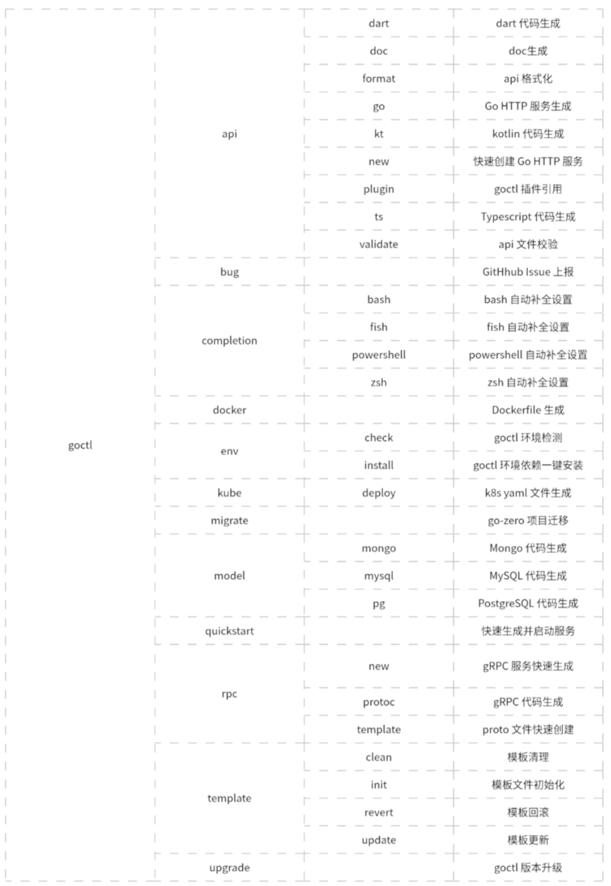

# 学习笔记

## 总结:

### Quickstart
```bash
mkdir quickstart && cd quickstart

# 快速生成 HTTP 单体服务并启动
goctl quickstart --service-type mono

# 快速生成 RPC 微服务并启动，外部包含了一个HTTP服务方便测试
goctl quickstart --service-type micro
```

### HTTP 服务
```bash
# 1.生成新项目
goctl api new order

# 2.修改根目录下的order.api文件，增加需要的HTTP接口

# 3. 重新生成
goctl api go -api order.api -dir ./
goctl api go -api order.api -dir ./ -style go_zero      # -style定义了生成文件的命名规则

# 4. 修改 order/internal/logic文件中的接口实现逻辑

# 5. 如果需要使用中间件，请在order/internal/handler/routes.go的RegisterHandlers中修改
```

#### HTTP api请求支持参数校验
```go
type createRequest {
    token string `header:"authorization"`
    name    string  `path:"name"`
    age     int     `form:"age,default=18,range=[18:100)"`
    role    string  `json:"role,options=teacher|parent"`
    address string  `json:"address,optional"`
    from    string  `path:"from,options=you|me"`            // 路由参数
}
```

### RPC 服务
```bash
# 1. 创建项目目录
mkdir -p demo/rpc

# 2. 在rpc目录下创建模版proto文件
goctl rpc -o=demo.proto

# 3. 在项目demo根目录下创建工程，根据demo.proto [如果有问题尝试 go work use demo]
goctl rpc protoc rpc/demo.proto --go_out=./pb --go-grpc_out=./pb --zrpc_out=.

# 4. 在demo/internal/logic中实现rpc接口逻辑，如果需要什么信息，可将其添加到internal/svc/servicecontext.go的ServiceContext中
# 增加其他rpc_clt也是在这里添加

# 5. 在demo.proto增加新接口，同步3.4过程
```
-----

[ B站码神之路::go-zero ](https://www.mszlu.com/go/go-zero/02/02.html#_1-%E7%8E%AF%E5%A2%83%E5%87%86%E5%A4%87)
[ zero-example ](https://github.com/zeromicro/zero-examples) 其中的**bookstore** 使用很规范，可参考(1HTTP+2RPC+1DB)；**shorturl**也可参考
[Go 服务自动收集线上问题现场](https://juejin.cn/post/7171949320709603342) 线上开启/关闭pprof,定位问题


## goctl 安装

```bash
# 安装
go install github.com/zeromicro/go-zero/tools/goctl@latest

# 验证
goctl --version
```

## protoc 安装

```bash
goctl env check --install --verbose --force

# 验证
goctl env check --verbose
```


## go-zero 安装

```bash
mkdir <project name> && cd <project name> # project name 为具体值
go mod init <module name> # module name 为具体值
go get -u github.com/zeromicro/go-zero@latest
```


## goctl 创建项目 http 项目
```bash
goctl api new greet

go mod init
go mod tidy

# 启动
go run greet.go -f etc/greet-api.yaml

# 测试
curl -i http://localhost:8888/from/you
```

## goctl 创建微服务商城项目 micro_mall

假设有两个服务：
- order service
- user service
用户在查询订单时，同时需要获取用户信息。
user模块需要提供一个grpc的api，用于order调用。

### 1. 初始化项目
```bash
mkdir micro_mall
cd micro_mall
goctl api new order
goctl api new user

go work init
go work use order           # 前提是order项目下已经有go.mod
go work use user            # 即：模块必须是 go mod 依赖管理的仓库
```

### 2. 添加 rpc::user.proto文件

### 3. 生成proto相关代码
```bash
# 在 user/rpc 下执行
goctl rpc protoc user.proto --go_out=./types --go-grpc_out=./types --zrpc_out=.
# 然后将生成文件（除user.proto外）等文件移动到上一级目录，即 将 user 下的服务进行整体替换

# 或 直接在user下执行 [推荐使用该种方法]
goctl rpc protoc rpc/user.proto --go_out=./types --go-grpc_out=./types --zrpc_out=.
```

### 4. order项目增加 user的clt
```bash
# order/order.api
type (
	OrderReq {
		Id string `path:"id"`
	}

	OrderReply {
		Id       string `json:"id"`
		Name     string `json:"name"`
		UserName string `json:"userName"`
	}
)

service order-api {
	@handler OrderHandler
	get /from/:name (Request) returns (Response)

	@handler GetOrderHandler
	get /api/order/get/:id (OrderReq) returns (OrderReply)
}
```
并在 order 目录下执行:
```bash
goctl api go -api order.api -dir ./
```

### 5. 使用docker_compose启动etcd容器
docker-compose.yaml启动时会自动读取.env环境变量
```bash
docker-compose up -d
```


### 6. mysq的读写

#### 6.1 增加mysql到docker-compose 并创建user表
```sql
CREATE TABLE `user`  (
  `id` bigint(0) NOT NULL AUTO_INCREMENT,
  `name` varchar(255) CHARACTER SET utf8mb4 COLLATE utf8mb4_general_ci NOT NULL,
  `gender` varchar(255) CHARACTER SET utf8mb4 COLLATE utf8mb4_general_ci NOT NULL,
  PRIMARY KEY (`id`) USING BTREE
) ENGINE = InnoDB CHARACTER SET = utf8mb4 COLLATE = utf8mb4_general_ci ROW_FORMAT = Dynamic;
```
#### 6.2 创建user/model/user.sql文件，并将上述sql拷贝进去,并执行goctl model mysql
```bash
# goctl
# goctl model  --help

## 1. 方式一（ddl）
cd user/model
goctl model mysql ddl -src user.sql -dir . -c

## 2. 方式二（datasource, 即使用data_url）
goctl model mysql datasource -url="$datasource" -table="user" -c -dir .
```

#### 6.3 手动造轮子(mysql)


### 7. go-redis的使用


### 8. jwt的使用 
[参考文章](https://cloud.tencent.com/developer/article/1460770)

jwt(JSON Web Token)目前在**登录**、**鉴权**等场景应用非常广泛.
jwt 是**加密的字符串**，需要一个密钥，并可以通过设置过期时间来使jwt生成的token失效。
**什么情况下使用JWT比较适合？**
- **授权**：这是最常见的使用场景，解决单点登录问题。因为JWT使用起来轻便，开销小，**服务端不用记录用户状态信息（无状态）**，所以使用比较广泛；
- **信息交换**：JWT是在各个服务之间安全传输信息的好方法。因为JWT可以签名，例如，使用公钥/私钥对儿 - 可以确定请求方是合法的。此外，由于使用标头和有效负载计算签名，还可以验证内容是否未被篡改。
  
一个token分3部分，按顺序:
- 头部(header)
- 载荷(payload)
- 签证(signature)
对象为一个很长的字符串，字符之间通过"."分隔符分为三个子串。注意JWT对象为一个长字串，各字串之间也没有换行符，一般格式为：**xxxxx.yyyyy.zzzzz** 。


#### goctl方法
```bash
# 1. 在 gate.api中增加 @server jwt:Auth 字段
@server (
	jwt: Auth
)
service gate-api {
	@handler GateTestHandler
	get /from/:name (Request) returns (Response)

	@handler GetUserHandler
	get /user/get/:id (IdRequest) returns (UserResponse)

	@handler RegisterHandler
	post /register (UserRegisterReq) returns (UserRegisterRsp)

	@handler LoginHandler
	post /login (UserLoginReq) returns (UserLoginRsp)
}

# 2. 命令行执行
goctl api go -api gate.api -dir . 
```

#### 手动添加只需在 `routes.go` 中增加如下一段
```golang
rest.WithJwt(serverCtx.Config.Auth.AccessSecret),
```

即

```golang
func RegisterHandlers(server *rest.Server, serverCtx *svc.ServiceContext) {
	handler := NewUserHandler(serverCtx)
	server.AddRoutes(
		[]rest.Route{
			{
				Method:  http.MethodPost,
				Path:    "/register",
				Handler: handler.Register,
			},
			{
				Method:  http.MethodPost,
				Path:    "/login",
				Handler: handler.Login,
			},
		},
	)
	server.AddRoutes(
		[]rest.Route{
			{
				Method:  http.MethodGet,
				Path:    "/user/get/:id",
				Handler: handler.GetUser,
			},
		},
		rest.WithJwt(serverCtx.Config.Auth.AccessSecret),
	)
}
```

#### 鉴权接口获取并使用token
```golang
func (l *UserLogic) GetUser(req *types.IdRequest) (resp *types.UserResponse, err error) {
	// todo: add your logic here and delete this line

	// 认证通过后，可从token中获取用于id userid， 框架会将其保存在 ctx 上下文中
	userId := l.ctx.Value("userId")
	logx.Info("获取的token内容:%S \n", userId)
    
    ...
}
```


### Prometheus Graph 查询语法
```
{app='user-rpc'}
```


### goctl 命令列表
